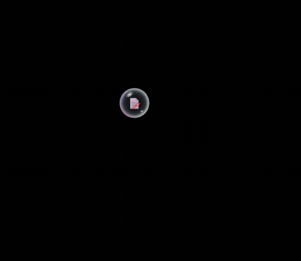

<div align="center">

# 📝 StickyTasks

### A sticky note that never gets in your way.

Opens with Windows. One hotkey brings it up. Stays out of your taskbar.


[**⬇ Download the installer**](https://github.com/vrunani/StickyTasks/releases/download/v1.1.0/StickyTasks.Setup.1.1.0.exe)

</div>

<div align="center">
  
</div>

---

## ✨ Why StickyTasks

- **Ready when you are.** Starts with Windows, in the state you left it.
- **One hotkey.** `Ctrl + Shift + T` shows or hides it from anywhere.
- **Out of your way.** No taskbar button while it is open.
- **Type on the paper.** Click the blank line and write.
- **Floating bubble.** Need space? It shrinks into a small bubble with your open-task count.
- **Self-cleaning.** Done tasks delete themselves after 1 day or 1 week.
- **Reminders.** Windows notifications when a task is due.
- **Your look.** Pick a theme, or follow Windows light and dark.
- **Private.** Works offline. Your data stays on your PC.

---

## 🚀 Install

1. [**Download StickyTasks Setup 1.1.0**](https://github.com/vrunani/StickyTasks/releases/download/v1.1.0/StickyTasks.Setup.1.1.0.exe).
2. Run the file and follow the wizard.
3. Done. Press `Ctrl + Shift + T` to open it.

All versions are on the [Releases page](https://github.com/vrunani/StickyTasks/releases).

> Windows may show an "unknown publisher" warning. The app is not code-signed yet.
> Click **More info**, then **Run anyway**.

No admin rights needed. Updates arrive automatically.

---

## ⌨️ Quick guide

| Do this | Result |
|---|---|
| Click the blank line, type, press `Enter` | Adds a task |
| Click a task | Edits it in place |
| `Esc` | Cancels an edit |
| Tick the round box | Finishes the task |
| Drag the dots handle | Reorders tasks |
| Hover a task, click `×` | Deletes it (with Undo) |
| Hover a task, click the clock | Sets a reminder |
| Click `–` on the note | Shrinks it into a bubble |
| Click the bubble | Opens the note |
| `Ctrl + Shift + T` | Shows or hides the note |
| `?` | Shows all shortcuts |

---

## 🎨 Themes

Yellow · Dark · Blue · Pink · Green · **Follow Windows**

Change it from the palette button, the tray menu, or Settings.

---

## 🔒 Your data

- Stored locally in a SQLite file.
- Nothing is uploaded.
- Updates and reinstalls keep your tasks.
- Export and import as JSON.

| Item | Location |
|---|---|
| Database | `%APPDATA%\StickyTasks\tasks.db` |
| Logs | `%APPDATA%\StickyTasks\logs\app.log` |

---

## 🛠 Built with

| Layer | Tech |
|---|---|
| Desktop shell | Electron 39 |
| Interface | React 18 + Vite 5 |
| Database | Built-in `node:sqlite` |
| Installer | electron-builder (NSIS) |
| Auto-update | electron-updater + GitHub Releases |

**Design choices**
- The UI never touches the database.
- The main process validates every message.
- Context isolation is on. Node access is off in the UI.
- All SQL uses prepared statements.

---

## 💻 Development

```bash
npm install      # no compiler needed
npm run dev      # run Vite + Electron
npm run build    # build the installer into release\
```

Run the terminal as Administrator, or turn on Developer Mode, the first time you build.

<details>
<summary><b>Project structure</b></summary>

```
stickytasks/
├─ electron/    main process: windows, tray, db, reminders, updater
├─ src/         React interface
├─ build/       installer resources
└─ assets/      app icon
```

</details>

---

## 🗺 Roadmap

- [ ] Optional Firebase sign-in and cloud backup
- [ ] Code-signing certificate
- [ ] Task colours, sub-tasks, search
- [ ] Marathi and Hindi translations
- [ ] Mac and Linux builds

---

<div align="center">

Made by [vrunani](https://github.com/vrunani)

If you like it, give it a ⭐

</div>
